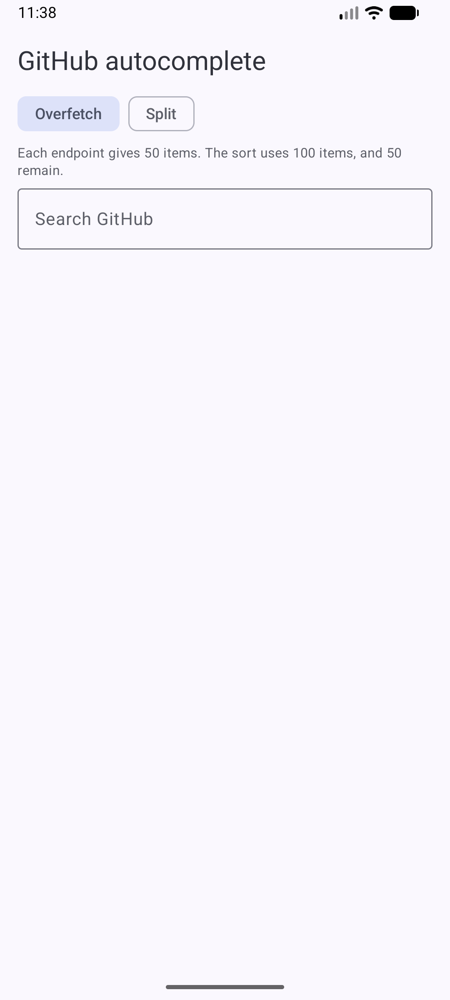
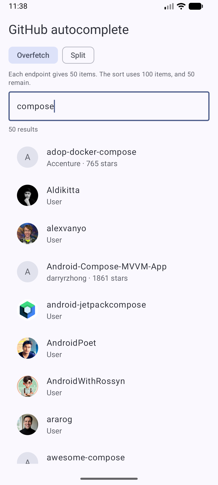
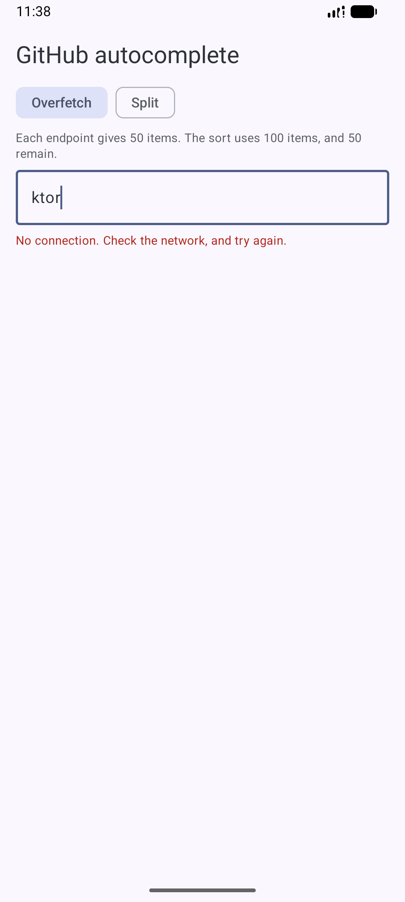

# GitHub autocomplete

[](https://github.com/tomekdz/github-autocomplete/actions/workflows/ci.yml)

A native Android autocomplete component for GitHub users and repositories. The
user types at least three characters, the app searches both GitHub Search API
endpoints, merges the results, and shows one alphabetically sorted list.

The autocomplete state and UI are GitHub-specific. They know about
`GithubResult`, but they do not know about Retrofit, OkHttp, Coil, Hilt, tokens,
or Android transport details.

This document uses ASD-STE100 (Simplified Technical English), as
[CONVENTIONS.md](CONVENTIONS.md) requires.

## What It Does

- Searches GitHub users and repositories.
- Starts a search only after `AutocompleteConfig.minQueryLength`, which defaults
  to 3 characters.
- Debounces input and cancels old searches with `flatMapLatest`.
- Merges users and repositories into one list.
- Sorts by repository name or user login, with stable tie rules.
- Limits the final result list with `AutocompleteConfig.resultLimit`, which
  defaults to 50.
- Shows idle, loading, empty, success, partial success, and failure states.
- Searches again on demand with `AutocompleteState.refresh()`, which the
  strategy toggle uses.
- Opens the result on github.com in a Custom Tab when the user selects it.
- Supports an optional debug GitHub token.

| Empty | Results | No network |
|---|---|---|
|  |  |  |

## Project Layout

```
:app                         Application, Hilt setup, one Activity, token binding
:feature-home                Demo screen
:autocomplete:github-ui      GitHub drop-in Compose component and ViewModel
:autocomplete:github-data    GitHub transport, DTOs, merge and sort policy
:autocomplete:github-model   GithubResult and FetchStrategy: the host types
:autocomplete:ui-compose     GitHub Compose autocomplete field
:autocomplete:domain         Pure Kotlin GitHub state holder and contracts
:core-ui                     Theme, colour, and type
:core-testing                Hilt runner for instrumented tests
```

The module graph protects the transport boundary:

- `:autocomplete:domain` is pure Kotlin.
- `:autocomplete:domain` and `:autocomplete:ui-compose` can use `GithubResult`,
  but do not depend on transport code.
- `:autocomplete:github-ui` is the module that connects the UI to the GitHub
  transport.
- `:feature-home` receives `:autocomplete:github-model` and no transport code.
  `:autocomplete:github-ui` takes `:autocomplete:github-data` with `implementation`,
  therefore the factory, the token interceptor, and the DTOs are not on the
  compile path of a feature. `./gradlew :feature-home:dependencies` shows this.

## Public API

The state holder owns the query, debounce, cancellation, and UI state. It takes a
GitHub search function, which tests can replace with an offline fake:

```kotlin
class AutocompleteState(
    search: suspend (query: String, limit: Int) -> SearchOutcome,
    scope: CoroutineScope,
    config: AutocompleteConfig = AutocompleteConfig(),
) {
    val query: StateFlow<String>
    val uiState: StateFlow<AutocompleteUiState>
    fun onQueryChange(value: String)
    fun refresh()
}
```

The Compose field renders GitHub results:

```kotlin
@Composable
fun AutocompleteField(
    state: AutocompleteState,
    itemContent: @Composable (GithubResult) -> Unit,
    modifier: Modifier = Modifier,
    placeholder: String = "",
)
```

The transport module exposes a factory, which a host never calls, because
`:autocomplete:github-ui` hides that module:

```kotlin
fun githubSearch(
    callFactory: Call.Factory,
    strategy: FetchStrategy = FetchStrategy.Overfetch,
    baseUrl: String = GITHUB_API_BASE_URL,
): suspend (query: String, limit: Int) -> SearchOutcome
```

The drop-in component shows only the types of `:autocomplete:github-model`:

```kotlin
@Composable
fun GithubAutocomplete(
    modifier: Modifier = Modifier,
    strategy: FetchStrategy = FetchStrategy.Overfetch,
    onResultClick: (GithubResult) -> Unit = {},
)
```

A host screen then contains one line:

```kotlin
GithubAutocomplete(modifier = Modifier.fillMaxWidth())
```

## GitHub Search Limits

GitHub Search does not provide alphabetical sorting for users or repositories.
The API returns a relevance-ranked page, and this project sorts that page
locally. Therefore the list is the alphabetical order of the returned candidate
set, not the alphabetical first 50 of every possible match.

Two fetch strategies make the trade-off explicit:

```kotlin
enum class FetchStrategy { Overfetch, Split }
```

`Overfetch` asks each endpoint for the whole limit, merges 100 candidates, and
keeps 50. `Split` asks each endpoint for half the limit, merges 50, and discards
nothing. `Overfetch` gives a better local sort. `Split` transfers fewer bytes.

The item count that a strategy costs belongs to the transport. It is an internal
property of `:autocomplete:github-data`, and not part of the model type that a
host names.

## Build And Test

```bash
./gradlew assembleDebug
./gradlew test
./gradlew :autocomplete:github-data:test
./gradlew :autocomplete:ui-compose:connectedDebugAndroidTest
./gradlew detekt
./gradlew spotlessCheck
./gradlew lint
```

Unit tests use JUnit 5. Instrumented and Compose tests use JUnit 4. The CI
workflow runs the debug build, unit tests, Detekt, Spotless, Android Lint, and
the Compose tests on an emulator.

The tests cover:

- sort order and tie rules;
- GitHub transport mapping and error mapping with MockWebServer;
- merge, limit, and partial failure policy;
- debounce, cancellation, and state transitions with Turbine;
- Compose behaviour with fake `GithubResult` search functions.

## Optional Token

The app works without a GitHub token, but GitHub applies a lower anonymous rate
limit. To use a token for local debug builds, add it to `local.properties`:

```properties
github.token=<your personal access token>
```

`local.properties` is ignored by Git.

The token is private, but it is not secret. A debug APK contains the token in
`BuildConfig`, and a person with the APK can read it. Release builds always use
an empty token and search unauthenticated. A production design that needs a real
secret must keep it on a server or use user-owned OAuth tokens.

## Licence

Apache License 2.0. The [LICENSE](LICENSE) file holds the text.

The project scaffold comes from
[android/architecture-templates](https://github.com/android/architecture-templates),
which is Apache 2.0. Files that remain from that template keep their AOSP
copyright header.
